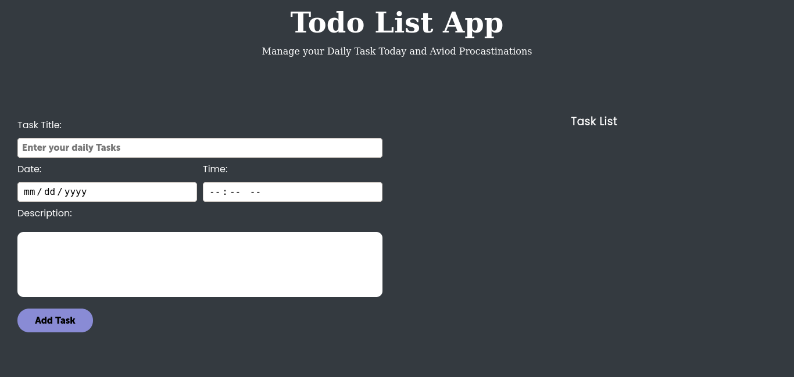
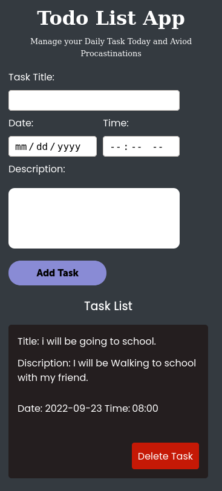

# Todo-app-vanillajs

<h1 align="center">TODO LIST APP</h1>

<div align="center">
<h2> Learn by Bluiding Projects</h2>
</div>

<div align="center">
  <h3>
    <a href="https://feel-todoapp-vanillajs.netlify.app/">
      Demo
    </a>
    </h3>
</div>

## Desktop View



## Mobile View



### Built With

- [HTML](https://html.org/)
- [CSS](https://w3.org/)
- [Javascript](https://javascript.com)

## Features

This application/site was created as a Beginner in Javascript to understand the basics of [Classes in Object Oriented Programming](https://www.w3schools.com/java/java_oop.asp) by bluiding a real todo app project.

## How To Use

<!-- Example: -->

To clone and run this application, you'll need [Git](https://git-scm.com) and [Node.js](https://nodejs.org/en/download/) (which comes with [npm](http://npmjs.com)) installed on your computer. From your command line:

```bash
# Clone this repository
$ git clone https://github.com/feelchi1star/Todo-app-vanillajs.git

# Install dependencies
$ npm install

# Run the app
$ npm start
```

# Acknowledgements

- [Steps to replicate a design with only HTML and CSS](https://devchallenges-blogs.web.app/how-to-replicate-design/)
- [Node.js](https://nodejs.org/)
- [Marked - a markdown parser](https://github.com/chjj/marked)

## Contact

- Website [Feelchi1star.com](https://www.feelchi1star.com)
- GitHub [Feelchi1star](https://github.com/feelchi1star)
- Twitter [@Feelchi1star](https://twitter.com/feelchi1starcom)
